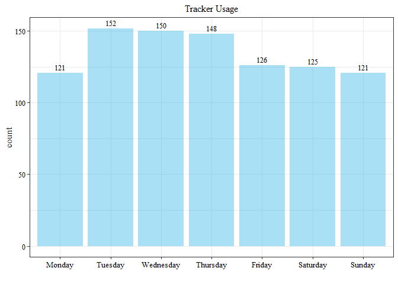
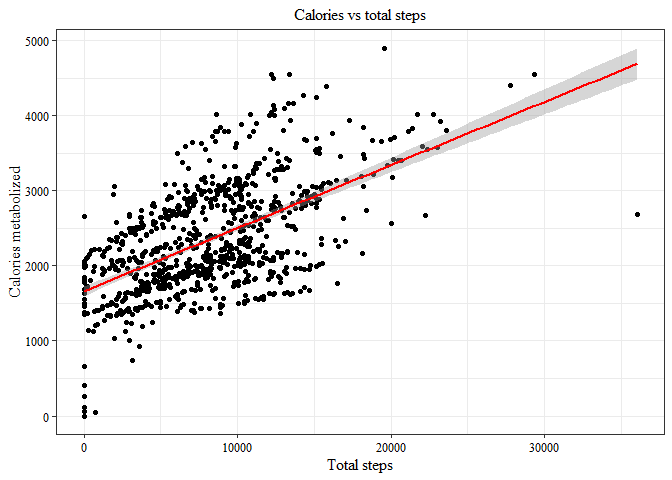
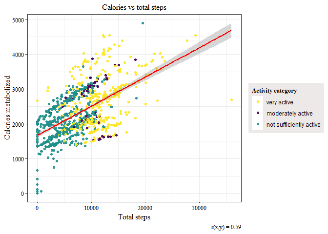
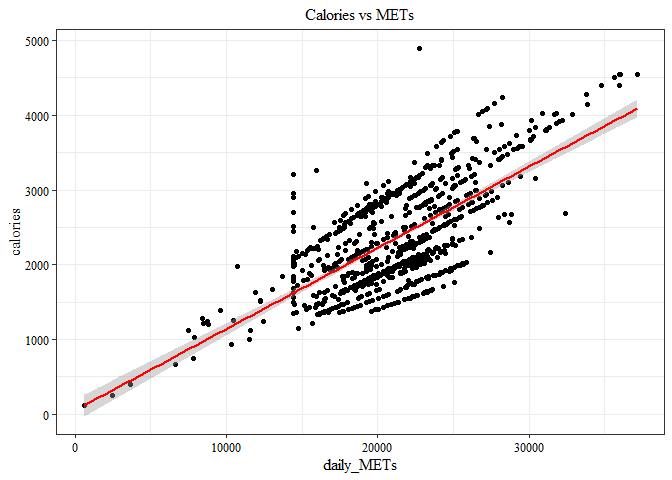
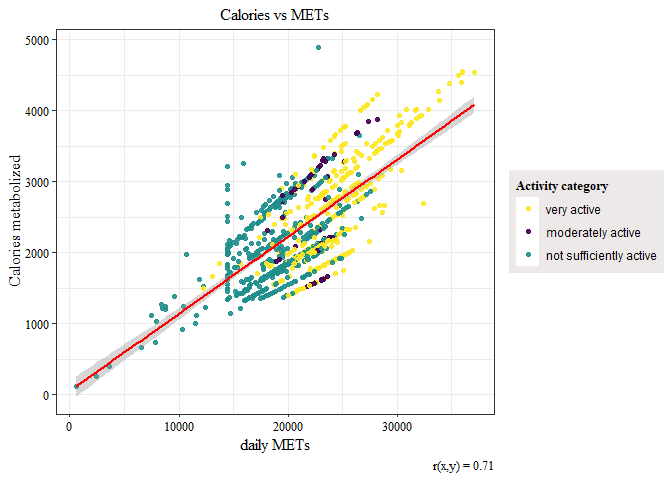
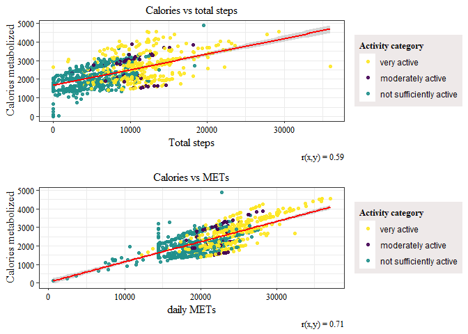
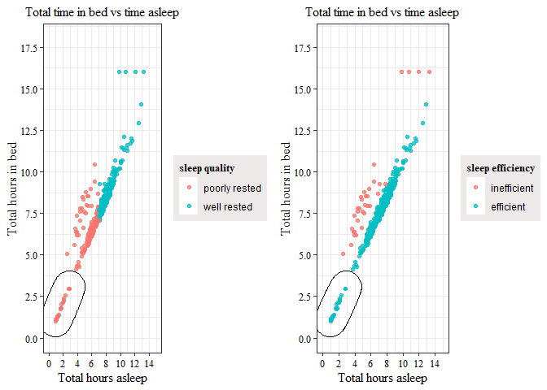
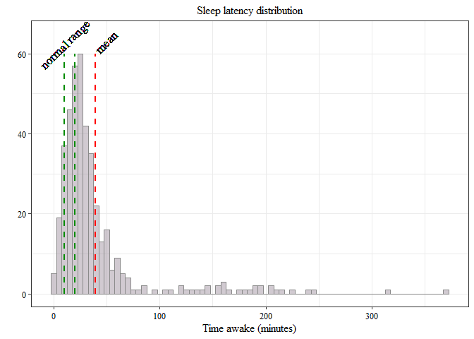
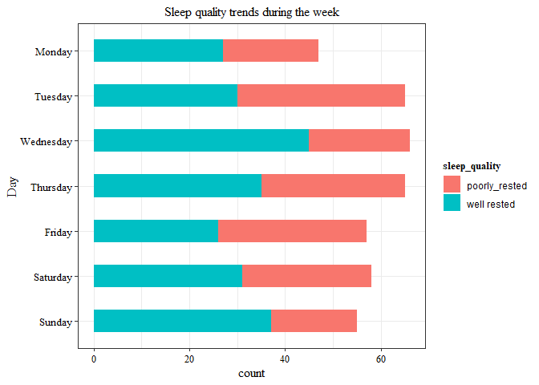
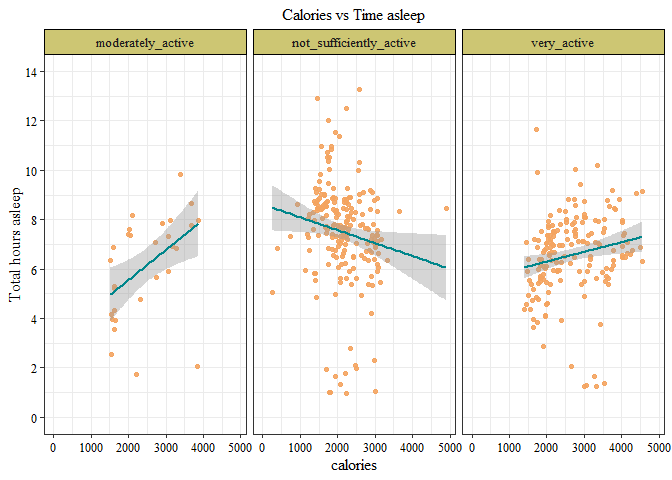

Bellabeat_Analysis
================
Lavanya Muthukumar
2022-06-29

1.  Setting up the environment

``` r
library(tidyverse)
```

    ## Warning: package 'readr' was built under R version 4.1.3

``` r
library(ggplot2)
library(lubridate)
library(gridExtra)
library(janitor)
library(ggforce)
```

    ## Warning: package 'ggforce' was built under R version 4.1.3

2.  Importing and Previewing data

2.a Loading data

``` r
#loading in the csv files

activity <- read_csv("fitbit_data/dailyActivity_merged.csv") %>% clean_names()
```

    ## Rows: 940 Columns: 15

    ## -- Column specification --------------------------------------------------------
    ## Delimiter: ","
    ## chr  (1): ActivityDate
    ## dbl (14): Id, TotalSteps, TotalDistance, TrackerDistance, LoggedActivitiesDi...

    ## 
    ## i Use `spec()` to retrieve the full column specification for this data.
    ## i Specify the column types or set `show_col_types = FALSE` to quiet this message.

``` r
head(activity)
```

    ## # A tibble: 6 x 15
    ##           id activity_date total_steps total_distance tracker_distance
    ##        <dbl> <chr>               <dbl>          <dbl>            <dbl>
    ## 1 1503960366 4/12/2016           13162           8.5              8.5 
    ## 2 1503960366 4/13/2016           10735           6.97             6.97
    ## 3 1503960366 4/14/2016           10460           6.74             6.74
    ## 4 1503960366 4/15/2016            9762           6.28             6.28
    ## 5 1503960366 4/16/2016           12669           8.16             8.16
    ## 6 1503960366 4/17/2016            9705           6.48             6.48
    ## # ... with 10 more variables: logged_activities_distance <dbl>,
    ## #   very_active_distance <dbl>, moderately_active_distance <dbl>,
    ## #   light_active_distance <dbl>, sedentary_active_distance <dbl>,
    ## #   very_active_minutes <dbl>, fairly_active_minutes <dbl>,
    ## #   lightly_active_minutes <dbl>, sedentary_minutes <dbl>, calories <dbl>

``` r
daily_calories <- read_csv("fitbit_data/dailyCalories_merged.csv") %>% clean_names()
```

    ## Rows: 940 Columns: 3

    ## -- Column specification --------------------------------------------------------
    ## Delimiter: ","
    ## chr (1): ActivityDay
    ## dbl (2): Id, Calories

    ## 
    ## i Use `spec()` to retrieve the full column specification for this data.
    ## i Specify the column types or set `show_col_types = FALSE` to quiet this message.

``` r
hourly_calories <- read_csv("fitbit_data/hourlyCalories_merged.csv") %>% clean_names()
```

    ## Rows: 22099 Columns: 3

    ## -- Column specification --------------------------------------------------------
    ## Delimiter: ","
    ## chr (1): ActivityHour
    ## dbl (2): Id, Calories

    ## 
    ## i Use `spec()` to retrieve the full column specification for this data.
    ## i Specify the column types or set `show_col_types = FALSE` to quiet this message.

``` r
head(hourly_calories)
```

    ## # A tibble: 6 x 3
    ##           id activity_hour         calories
    ##        <dbl> <chr>                    <dbl>
    ## 1 1503960366 4/12/2016 12:00:00 AM       81
    ## 2 1503960366 4/12/2016 1:00:00 AM        61
    ## 3 1503960366 4/12/2016 2:00:00 AM        59
    ## 4 1503960366 4/12/2016 3:00:00 AM        47
    ## 5 1503960366 4/12/2016 4:00:00 AM        48
    ## 6 1503960366 4/12/2016 5:00:00 AM        48

``` r
sleep <- read_csv("fitbit_data/sleepDay_merged.csv") %>% clean_names()
```

    ## Rows: 413 Columns: 5

    ## -- Column specification --------------------------------------------------------
    ## Delimiter: ","
    ## chr (1): SleepDay
    ## dbl (4): Id, TotalSleepRecords, TotalMinutesAsleep, TotalTimeInBed

    ## 
    ## i Use `spec()` to retrieve the full column specification for this data.
    ## i Specify the column types or set `show_col_types = FALSE` to quiet this message.

``` r
daily_intensities <- read_csv("fitbit_data/dailyIntensities_merged.csv") %>% clean_names()
```

    ## Rows: 940 Columns: 10

    ## -- Column specification --------------------------------------------------------
    ## Delimiter: ","
    ## chr (1): ActivityDay
    ## dbl (9): Id, SedentaryMinutes, LightlyActiveMinutes, FairlyActiveMinutes, Ve...

    ## 
    ## i Use `spec()` to retrieve the full column specification for this data.
    ## i Specify the column types or set `show_col_types = FALSE` to quiet this message.

``` r
hourly_intensities <- read_csv("fitbit_data/hourlyIntensities_merged.csv") %>% clean_names()
```

    ## Rows: 22099 Columns: 4

    ## -- Column specification --------------------------------------------------------
    ## Delimiter: ","
    ## chr (1): ActivityHour
    ## dbl (3): Id, TotalIntensity, AverageIntensity

    ## 
    ## i Use `spec()` to retrieve the full column specification for this data.
    ## i Specify the column types or set `show_col_types = FALSE` to quiet this message.

``` r
weight <- read_csv("fitbit_data/weightLoginfo_merged.csv") %>% clean_names()
```

    ## Rows: 67 Columns: 8

    ## -- Column specification --------------------------------------------------------
    ## Delimiter: ","
    ## chr (1): Date
    ## dbl (6): Id, WeightKg, WeightPounds, Fat, BMI, LogId
    ## lgl (1): IsManualReport

    ## 
    ## i Use `spec()` to retrieve the full column specification for this data.
    ## i Specify the column types or set `show_col_types = FALSE` to quiet this message.

``` r
MET <- read_csv("fitbit_data/minuteMETsNarrow_merged.csv") %>% clean_names()
```

    ## Rows: 1325580 Columns: 3

    ## -- Column specification --------------------------------------------------------
    ## Delimiter: ","
    ## chr (1): ActivityMinute
    ## dbl (2): Id, METs

    ## 
    ## i Use `spec()` to retrieve the full column specification for this data.
    ## i Specify the column types or set `show_col_types = FALSE` to quiet this message.

2.b Previewing data, column names and attribute formats

``` r
#initial data glimpse

head(activity)
```

    ## # A tibble: 6 x 15
    ##           id activity_date total_steps total_distance tracker_distance
    ##        <dbl> <chr>               <dbl>          <dbl>            <dbl>
    ## 1 1503960366 4/12/2016           13162           8.5              8.5 
    ## 2 1503960366 4/13/2016           10735           6.97             6.97
    ## 3 1503960366 4/14/2016           10460           6.74             6.74
    ## 4 1503960366 4/15/2016            9762           6.28             6.28
    ## 5 1503960366 4/16/2016           12669           8.16             8.16
    ## 6 1503960366 4/17/2016            9705           6.48             6.48
    ## # ... with 10 more variables: logged_activities_distance <dbl>,
    ## #   very_active_distance <dbl>, moderately_active_distance <dbl>,
    ## #   light_active_distance <dbl>, sedentary_active_distance <dbl>,
    ## #   very_active_minutes <dbl>, fairly_active_minutes <dbl>,
    ## #   lightly_active_minutes <dbl>, sedentary_minutes <dbl>, calories <dbl>

``` r
head(sleep)
```

    ## # A tibble: 6 x 5
    ##           id sleep_day      total_sleep_reco~ total_minutes_as~ total_time_in_b~
    ##        <dbl> <chr>                      <dbl>             <dbl>            <dbl>
    ## 1 1503960366 4/12/2016 12:~                 1               327              346
    ## 2 1503960366 4/13/2016 12:~                 2               384              407
    ## 3 1503960366 4/15/2016 12:~                 1               412              442
    ## 4 1503960366 4/16/2016 12:~                 2               340              367
    ## 5 1503960366 4/17/2016 12:~                 1               700              712
    ## 6 1503960366 4/19/2016 12:~                 1               304              320

``` r
head(weight)
```

    ## # A tibble: 6 x 8
    ##           id date   weight_kg weight_pounds   fat   bmi is_manual_report  log_id
    ##        <dbl> <chr>      <dbl>         <dbl> <dbl> <dbl> <lgl>              <dbl>
    ## 1 1503960366 5/2/2~      52.6          116.    22  22.6 TRUE             1.46e12
    ## 2 1503960366 5/3/2~      52.6          116.    NA  22.6 TRUE             1.46e12
    ## 3 1927972279 4/13/~     134.           294.    NA  47.5 FALSE            1.46e12
    ## 4 2873212765 4/21/~      56.7          125.    NA  21.5 TRUE             1.46e12
    ## 5 2873212765 5/12/~      57.3          126.    NA  21.7 TRUE             1.46e12
    ## 6 4319703577 4/17/~      72.4          160.    25  27.5 TRUE             1.46e12

``` r
head(MET)
```

    ## # A tibble: 6 x 3
    ##           id activity_minute       me_ts
    ##        <dbl> <chr>                 <dbl>
    ## 1 1503960366 4/12/2016 12:00:00 AM    10
    ## 2 1503960366 4/12/2016 12:01:00 AM    10
    ## 3 1503960366 4/12/2016 12:02:00 AM    10
    ## 4 1503960366 4/12/2016 12:03:00 AM    10
    ## 5 1503960366 4/12/2016 12:04:00 AM    10
    ## 6 1503960366 4/12/2016 12:05:00 AM    12

``` r
#knowing the column names 

colnames(activity)
```

    ##  [1] "id"                         "activity_date"             
    ##  [3] "total_steps"                "total_distance"            
    ##  [5] "tracker_distance"           "logged_activities_distance"
    ##  [7] "very_active_distance"       "moderately_active_distance"
    ##  [9] "light_active_distance"      "sedentary_active_distance" 
    ## [11] "very_active_minutes"        "fairly_active_minutes"     
    ## [13] "lightly_active_minutes"     "sedentary_minutes"         
    ## [15] "calories"

``` r
colnames(sleep)
```

    ## [1] "id"                   "sleep_day"            "total_sleep_records" 
    ## [4] "total_minutes_asleep" "total_time_in_bed"

``` r
colnames(weight)
```

    ## [1] "id"               "date"             "weight_kg"        "weight_pounds"   
    ## [5] "fat"              "bmi"              "is_manual_report" "log_id"

``` r
colnames(MET)
```

    ## [1] "id"              "activity_minute" "me_ts"

``` r
#checking to see if common attributes across data frames have similar format

str(activity)
```

    ## spec_tbl_df [940 x 15] (S3: spec_tbl_df/tbl_df/tbl/data.frame)
    ##  $ id                        : num [1:940] 1.5e+09 1.5e+09 1.5e+09 1.5e+09 1.5e+09 ...
    ##  $ activity_date             : chr [1:940] "4/12/2016" "4/13/2016" "4/14/2016" "4/15/2016" ...
    ##  $ total_steps               : num [1:940] 13162 10735 10460 9762 12669 ...
    ##  $ total_distance            : num [1:940] 8.5 6.97 6.74 6.28 8.16 ...
    ##  $ tracker_distance          : num [1:940] 8.5 6.97 6.74 6.28 8.16 ...
    ##  $ logged_activities_distance: num [1:940] 0 0 0 0 0 0 0 0 0 0 ...
    ##  $ very_active_distance      : num [1:940] 1.88 1.57 2.44 2.14 2.71 ...
    ##  $ moderately_active_distance: num [1:940] 0.55 0.69 0.4 1.26 0.41 ...
    ##  $ light_active_distance     : num [1:940] 6.06 4.71 3.91 2.83 5.04 ...
    ##  $ sedentary_active_distance : num [1:940] 0 0 0 0 0 0 0 0 0 0 ...
    ##  $ very_active_minutes       : num [1:940] 25 21 30 29 36 38 42 50 28 19 ...
    ##  $ fairly_active_minutes     : num [1:940] 13 19 11 34 10 20 16 31 12 8 ...
    ##  $ lightly_active_minutes    : num [1:940] 328 217 181 209 221 164 233 264 205 211 ...
    ##  $ sedentary_minutes         : num [1:940] 728 776 1218 726 773 ...
    ##  $ calories                  : num [1:940] 1985 1797 1776 1745 1863 ...
    ##  - attr(*, "spec")=
    ##   .. cols(
    ##   ..   Id = col_double(),
    ##   ..   ActivityDate = col_character(),
    ##   ..   TotalSteps = col_double(),
    ##   ..   TotalDistance = col_double(),
    ##   ..   TrackerDistance = col_double(),
    ##   ..   LoggedActivitiesDistance = col_double(),
    ##   ..   VeryActiveDistance = col_double(),
    ##   ..   ModeratelyActiveDistance = col_double(),
    ##   ..   LightActiveDistance = col_double(),
    ##   ..   SedentaryActiveDistance = col_double(),
    ##   ..   VeryActiveMinutes = col_double(),
    ##   ..   FairlyActiveMinutes = col_double(),
    ##   ..   LightlyActiveMinutes = col_double(),
    ##   ..   SedentaryMinutes = col_double(),
    ##   ..   Calories = col_double()
    ##   .. )
    ##  - attr(*, "problems")=<externalptr>

``` r
str(sleep)
```

    ## spec_tbl_df [413 x 5] (S3: spec_tbl_df/tbl_df/tbl/data.frame)
    ##  $ id                  : num [1:413] 1.5e+09 1.5e+09 1.5e+09 1.5e+09 1.5e+09 ...
    ##  $ sleep_day           : chr [1:413] "4/12/2016 12:00:00 AM" "4/13/2016 12:00:00 AM" "4/15/2016 12:00:00 AM" "4/16/2016 12:00:00 AM" ...
    ##  $ total_sleep_records : num [1:413] 1 2 1 2 1 1 1 1 1 1 ...
    ##  $ total_minutes_asleep: num [1:413] 327 384 412 340 700 304 360 325 361 430 ...
    ##  $ total_time_in_bed   : num [1:413] 346 407 442 367 712 320 377 364 384 449 ...
    ##  - attr(*, "spec")=
    ##   .. cols(
    ##   ..   Id = col_double(),
    ##   ..   SleepDay = col_character(),
    ##   ..   TotalSleepRecords = col_double(),
    ##   ..   TotalMinutesAsleep = col_double(),
    ##   ..   TotalTimeInBed = col_double()
    ##   .. )
    ##  - attr(*, "problems")=<externalptr>

``` r
str(weight) 
```

    ## spec_tbl_df [67 x 8] (S3: spec_tbl_df/tbl_df/tbl/data.frame)
    ##  $ id              : num [1:67] 1.50e+09 1.50e+09 1.93e+09 2.87e+09 2.87e+09 ...
    ##  $ date            : chr [1:67] "5/2/2016 11:59:59 PM" "5/3/2016 11:59:59 PM" "4/13/2016 1:08:52 AM" "4/21/2016 11:59:59 PM" ...
    ##  $ weight_kg       : num [1:67] 52.6 52.6 133.5 56.7 57.3 ...
    ##  $ weight_pounds   : num [1:67] 116 116 294 125 126 ...
    ##  $ fat             : num [1:67] 22 NA NA NA NA 25 NA NA NA NA ...
    ##  $ bmi             : num [1:67] 22.6 22.6 47.5 21.5 21.7 ...
    ##  $ is_manual_report: logi [1:67] TRUE TRUE FALSE TRUE TRUE TRUE ...
    ##  $ log_id          : num [1:67] 1.46e+12 1.46e+12 1.46e+12 1.46e+12 1.46e+12 ...
    ##  - attr(*, "spec")=
    ##   .. cols(
    ##   ..   Id = col_double(),
    ##   ..   Date = col_character(),
    ##   ..   WeightKg = col_double(),
    ##   ..   WeightPounds = col_double(),
    ##   ..   Fat = col_double(),
    ##   ..   BMI = col_double(),
    ##   ..   IsManualReport = col_logical(),
    ##   ..   LogId = col_double()
    ##   .. )
    ##  - attr(*, "problems")=<externalptr>

``` r
str(MET)
```

    ## spec_tbl_df [1,325,580 x 3] (S3: spec_tbl_df/tbl_df/tbl/data.frame)
    ##  $ id             : num [1:1325580] 1.5e+09 1.5e+09 1.5e+09 1.5e+09 1.5e+09 ...
    ##  $ activity_minute: chr [1:1325580] "4/12/2016 12:00:00 AM" "4/12/2016 12:01:00 AM" "4/12/2016 12:02:00 AM" "4/12/2016 12:03:00 AM" ...
    ##  $ me_ts          : num [1:1325580] 10 10 10 10 10 12 12 12 12 12 ...
    ##  - attr(*, "spec")=
    ##   .. cols(
    ##   ..   Id = col_double(),
    ##   ..   ActivityMinute = col_character(),
    ##   ..   METs = col_double()
    ##   .. )
    ##  - attr(*, "problems")=<externalptr>

``` r
#checking for NAs

colSums(is.na(activity))
```

    ##                         id              activity_date 
    ##                          0                          0 
    ##                total_steps             total_distance 
    ##                          0                          0 
    ##           tracker_distance logged_activities_distance 
    ##                          0                          0 
    ##       very_active_distance moderately_active_distance 
    ##                          0                          0 
    ##      light_active_distance  sedentary_active_distance 
    ##                          0                          0 
    ##        very_active_minutes      fairly_active_minutes 
    ##                          0                          0 
    ##     lightly_active_minutes          sedentary_minutes 
    ##                          0                          0 
    ##                   calories 
    ##                          0

``` r
colSums(is.na(sleep))
```

    ##                   id            sleep_day  total_sleep_records 
    ##                    0                    0                    0 
    ## total_minutes_asleep    total_time_in_bed 
    ##                    0                    0

``` r
colSums(is.na(weight))
```

    ##               id             date        weight_kg    weight_pounds 
    ##                0                0                0                0 
    ##              fat              bmi is_manual_report           log_id 
    ##               65                0                0                0

``` r
colSums(is.na(MET))
```

    ##              id activity_minute           me_ts 
    ##               0               0               0

``` r
#Checking for the total number of unique users

n_distinct(activity$id)
```

    ## [1] 33

``` r
n_distinct(daily_calories$id)
```

    ## [1] 33

``` r
n_distinct(hourly_calories$id)
```

    ## [1] 33

``` r
n_distinct(daily_intensities$id)
```

    ## [1] 33

``` r
n_distinct(hourly_intensities$id)
```

    ## [1] 33

``` r
n_distinct(sleep$id)
```

    ## [1] 24

``` r
n_distinct(weight$id)
```

    ## [1] 8

``` r
n_distinct(MET$id)
```

    ## [1] 33

3.  Data Wrangling

3.a Date cleaning

``` r
#correcting the format of dates

#The columns containing dates are in character format and has to be changed to date format; also creating new columns with common name "date" if data frames need to be merged for further analysis


activity$date_cor<- as.POSIXlt(activity$activity_date, format = "%m/%d/%Y")

activity$date <- format(activity$date_cor, format = "%Y/%m/%d" )

activity$wkday <- weekdays(activity$date_cor)

daily_calories$date <- as.POSIXlt(daily_calories$activity_day, format = "%m/%d/%Y" )
daily_calories$wkday <- weekdays(daily_calories$date)

hourly_calories$date_cor <- as.POSIXlt(hourly_calories$activity_hour, format = "%m/%d/%Y  %I:%M:%S %p")

hourly_calories$date <- format(hourly_calories$date_cor, format = "%Y/%m/%d")
hourly_calories$time <- format(hourly_calories$date_cor, format = "%H:%M:%S")
hourly_calories$wkday <- weekdays(hourly_calories$date_cor)


daily_intensities$date <- as.POSIXlt(daily_intensities$activity_day, format = "%m/%d/%Y" )
daily_intensities$wkday <- weekdays(daily_intensities$date)


hourly_intensities$date_cor <- as.POSIXlt(hourly_intensities$activity_hour, format = "%m/%d/%Y  %I:%M:%S %p")

hourly_intensities$date <- format(hourly_intensities$date_cor, format = "%Y/%m/%d")
hourly_intensities$time <- format(hourly_intensities$date_cor, format = "%H:%M:%S")
hourly_intensities$wkday <- weekdays(hourly_intensities$date_cor)

sleep$sleep_day_cor <- as.POSIXlt(sleep$sleep_day, format = "%m/%d/%Y %I:%M:%S %p")


sleep$date <- format(sleep$sleep_day_cor, format = "%Y/%m/%d" )
sleep$time <- format(sleep$sleep_day_cor, format = "%H:%M:%S")
sleep$wkday<- weekdays(sleep$sleep_day_cor)


weight$date_cor <- as.POSIXlt(weight$date, format = "%m/%d/%Y  %I:%M:%S %p")

weight$date_org <- weight$date

weight$date <- format(weight$date_cor, format = "%Y/%m/%d" )
weight$time <- format(weight$date_cor, format = "%H:%M:%S")
weight$wkday <- weekdays(weight$date_cor)


MET$activity_min_cor <- as.POSIXlt(MET$activity_minute, format = "%m/%d/%Y  %I:%M:%S %p")


MET$date <- format(MET$activity_min_cor, format = "%Y/%m/%d")
MET$time <- format(MET$activity_min_cor, format = "%H:%M:%S")
MET$wkday <- weekdays(MET$activity_min_cor)
```

3.b Sample summary statistics and distributions

``` r
#Overall sample summary statistics of essential metrics

activity %>% select(sedentary_minutes, total_steps, calories, total_distance) %>% summary()
```

    ##  sedentary_minutes  total_steps       calories    total_distance  
    ##  Min.   :   0.0    Min.   :    0   Min.   :   0   Min.   : 0.000  
    ##  1st Qu.: 729.8    1st Qu.: 3790   1st Qu.:1828   1st Qu.: 2.620  
    ##  Median :1057.5    Median : 7406   Median :2134   Median : 5.245  
    ##  Mean   : 991.2    Mean   : 7638   Mean   :2304   Mean   : 5.490  
    ##  3rd Qu.:1229.5    3rd Qu.:10727   3rd Qu.:2793   3rd Qu.: 7.713  
    ##  Max.   :1440.0    Max.   :36019   Max.   :4900   Max.   :28.030

``` r
daily_intensities %>% select(lightly_active_minutes, fairly_active_minutes, very_active_minutes) %>% summary()
```

    ##  lightly_active_minutes fairly_active_minutes very_active_minutes
    ##  Min.   :  0.0          Min.   :  0.00        Min.   :  0.00     
    ##  1st Qu.:127.0          1st Qu.:  0.00        1st Qu.:  0.00     
    ##  Median :199.0          Median :  6.00        Median :  4.00     
    ##  Mean   :192.8          Mean   : 13.56        Mean   : 21.16     
    ##  3rd Qu.:264.0          3rd Qu.: 19.00        3rd Qu.: 32.00     
    ##  Max.   :518.0          Max.   :143.00        Max.   :210.00

``` r
sleep %>% select(total_minutes_asleep, total_time_in_bed) %>% summary()
```

    ##  total_minutes_asleep total_time_in_bed
    ##  Min.   : 58.0        Min.   : 61.0    
    ##  1st Qu.:361.0        1st Qu.:403.0    
    ##  Median :433.0        Median :463.0    
    ##  Mean   :419.5        Mean   :458.6    
    ##  3rd Qu.:490.0        3rd Qu.:526.0    
    ##  Max.   :796.0        Max.   :961.0

``` r
weight %>% select(bmi) %>% summary()
```

    ##       bmi       
    ##  Min.   :21.45  
    ##  1st Qu.:23.96  
    ##  Median :24.39  
    ##  Mean   :25.19  
    ##  3rd Qu.:25.56  
    ##  Max.   :47.54

``` r
MET %>% select(me_ts) %>% summary()
```

    ##      me_ts       
    ##  Min.   :  0.00  
    ##  1st Qu.: 10.00  
    ##  Median : 10.00  
    ##  Mean   : 14.69  
    ##  3rd Qu.: 11.00  
    ##  Max.   :157.00

3.c Individual user level aggregate summary statistics

``` r
#creating summary tables for average values of individual users 

# table for daily activity

avg_activity <- activity %>%
  group_by(id) %>%
  summarise(average_steps = mean(total_steps),
  average_distance = mean(total_distance),
  average_light_active_minutes =mean(lightly_active_minutes),
 average_moderate_active_minutes =mean(fairly_active_minutes),
 average_very_active_minutes = mean(very_active_minutes),
 average_sedentary_minutes = mean(sedentary_minutes),
 average_calories = mean(calories))

avg_activity
```

    ## # A tibble: 33 x 8
    ##            id average_steps average_distance average_light_ac~ average_moderate~
    ##         <dbl>         <dbl>            <dbl>             <dbl>             <dbl>
    ##  1 1503960366        12117.            7.81              220.             19.2  
    ##  2 1624580081         5744.            3.91              153.              5.81 
    ##  3 1644430081         7283.            5.30              178.             21.4  
    ##  4 1844505072         2580.            1.71              115.              1.29 
    ##  5 1927972279          916.            0.635              38.6             0.774
    ##  6 2022484408        11371.            8.08              257.             19.4  
    ##  7 2026352035         5567.            3.45              257.              0.258
    ##  8 2320127002         4717.            3.19              198.              2.58 
    ##  9 2347167796         9520.            6.36              252.             20.6  
    ## 10 2873212765         7556.            5.10              308               6.13 
    ## # ... with 23 more rows, and 3 more variables:
    ## #   average_very_active_minutes <dbl>, average_sedentary_minutes <dbl>,
    ## #   average_calories <dbl>

``` r
#table for sleep patterns

avg_sleep <- sleep %>% group_by(id) %>% summarise(average_minutes_slept = mean(total_minutes_asleep), average_sleep_sessions = mean(total_sleep_records), average_time_in_bed = mean(total_time_in_bed))

avg_sleep
```

    ## # A tibble: 24 x 4
    ##            id average_minutes_slept average_sleep_sessions average_time_in_bed
    ##         <dbl>                 <dbl>                  <dbl>               <dbl>
    ##  1 1503960366                  360.                   1.08                383.
    ##  2 1644430081                  294                    1                   346 
    ##  3 1844505072                  652                    1                   961 
    ##  4 1927972279                  417                    1.6                 438.
    ##  5 2026352035                  506.                   1                   538.
    ##  6 2320127002                   61                    1                    69 
    ##  7 2347167796                  447.                   1                   491.
    ##  8 3977333714                  294.                   1.14                461.
    ##  9 4020332650                  349.                   1                   380.
    ## 10 4319703577                  477.                   1.04                502.
    ## # ... with 14 more rows

``` r
#table for weight logs

avg_weight <- weight %>% group_by(id) %>% summarise(average_weight = mean(weight_pounds), average_bmi = mean(bmi))

avg_weight 
```

    ## # A tibble: 8 x 3
    ##           id average_weight average_bmi
    ##        <dbl>          <dbl>       <dbl>
    ## 1 1503960366           116.        22.6
    ## 2 1927972279           294.        47.5
    ## 3 2873212765           126.        21.6
    ## 4 4319703577           160.        27.4
    ## 5 4558609924           154.        27.2
    ## 6 5577150313           200.        28  
    ## 7 6962181067           136.        24.0
    ## 8 8877689391           188.        25.5

3.d Data manipulation

The metabolic equivalent for task (MET) is a standardized unit that
estimates the amount of energy spent by the body during a particular
physical activity as opposed to when the body is in rest.[(click here
for more info on
METs)](https://www.verywellfit.com/met-the-standard-metabolic-equivalent-3120356).
It can be good indicator for measuring levels of physical exertion, and
further be used to pitch activities based on desired MET levels.

The data provided has MET levels by the minute. Lets create a new data
frame with daily MET levels for each user

``` r
# a new data frame for MET that includes total MET/day

MET_daily <- MET %>% select(id, date, wkday, me_ts) %>% group_by(id,date, wkday) %>% summarise(daily_METs = sum(me_ts))
```

    ## `summarise()` has grouped output by 'id', 'date'. You can override using the `.groups` argument.

``` r
MET_daily %>% summary()
```

    ##        id                date              wkday             daily_METs   
    ##  Min.   :1.504e+09   Length:934         Length:934         Min.   :  600  
    ##  1st Qu.:2.320e+09   Class :character   Class :character   1st Qu.:17908  
    ##  Median :4.445e+09   Mode  :character   Mode  :character   Median :21061  
    ##  Mean   :4.847e+09                                         Mean   :20849  
    ##  3rd Qu.:6.962e+09                                         3rd Qu.:23562  
    ##  Max.   :8.878e+09                                         Max.   :37117

``` r
#calculating the average MET for each user


avg_MET_daily <- MET_daily %>% group_by(id) %>% summarise(average_daily_METs = mean(daily_METs))

avg_MET_daily
```

    ## # A tibble: 33 x 2
    ##            id average_daily_METs
    ##         <dbl>              <dbl>
    ##  1 1503960366             23903.
    ##  2 1624580081             17838.
    ##  3 1644430081             19976.
    ##  4 1844505072             16805.
    ##  5 1927972279             15169.
    ##  6 2022484408             24120.
    ##  7 2026352035             19853.
    ##  8 2320127002             18725.
    ##  9 2347167796             21694.
    ## 10 2873212765             21774.
    ## # ... with 23 more rows

exploring the sleep data to create categories for sleep efficiency and
quality

``` r
#Efficient sleepers spend about 85% or more of their time in bed asleep

#lets calculate the sleep efficieny of users

sleep <-sleep %>% mutate(sleep_efficiency = total_minutes_asleep/ total_time_in_bed, sleep_efficiency_cat = ifelse(sleep_efficiency >= 0.85, "efficient", "inefficient")) 

# 

#lets calculate the time they were in bed but awake and also determine the quality of their sleep.

sleep <- sleep %>% mutate(time_awake = total_time_in_bed - total_minutes_asleep, sleep_hrs = total_minutes_asleep/60, sleep_quality = ifelse(sleep_hrs >= 7, "well rested", "poorly_rested"))
```

4.  Preliminary takeaways

<!-- -->

1.  Fitness tracker usage:

While all users in our sample track metrics such as step count, distance
walked, and minutes they have been active, comparatively fewer users
track their sleep cycle and weight associated metrics.

2.  Metrics summary:

Average sedentary minutes is about 991 minutes which is close to 16
hours and requires reduction

People have an average step count of 7638, which is slightly less than
the CDC recommended 8000 steps to reduce all cause mortality by 50%

Average fairly(moderate) active minutes is about 14 minutes/day, making
the weekly recommended target of 150 - 300 minutes a far stretch

Sleep cycle ranges form less than an hour to more than 13 hours with an
average of 7 hours a day.

BMI values are predominantly less than the overweight cutoff with an
average of 25.19

Since most of the essential metrics for lifestyle and physical activity
assessments are contained within the activity, sleep and METs data, we
will merge all three using the “id”, “date” and “wkday” columns, which
tracks the daily entry specific to each users

``` r
act_sleep <- left_join(activity, sleep, by = c("id", "date", "wkday"))

daily_data <- left_join(act_sleep, MET_daily, by = c("id", "date", "wkday"))

#factorizing the wkday column and ordering them
 
daily_data$wkday <- factor(daily_data$wkday,levels = c("Monday", "Tuesday", "Wednesday", "Thursday", "Friday", "Saturday" , "Sunday"), ordered = TRUE )


#daily_data_r <- daily_data %>% mutate(wkday_fac = factor(wkday, levels = c("Monday", "Tuesday", "Wednesday", "Thursday", "Friday", "Saturday" , "Sunday")), ordered = TRUE)
```

Activity level classification

Now lets classify the overall activity status of a user based on their
overall active minutes across different categories.

Very active - Have \>15 minutes of very active minutes and \>30 minutes
of moderate active minutes

Fairly active - Have either \>15 minutes of very active minutes or \>30
minutes of moderate active minutes

Insufficiently active - Have neither \>15 minutes of very active minutes
nor \>30 minutes of moderate active minutes

``` r
#daily_data <- daily_data %>% mutate(activity_cat = ifelse(very_active_minutes >=15 | fairly_active_minutes >= 30, "fairly_active", ifelse(very_active_minutes >=15 & fairly_active_minutes >= 30, "very_active", "not_sufficiently_active")))
```

``` r
daily_data <- daily_data %>% mutate(activity_cat = ifelse(very_active_minutes >=15, "very_active", ifelse(fairly_active_minutes >= 30, "moderately_active", "not_sufficiently_active" )))
```

5.  Data Analysis and Visualization

creating presets for formatting the graph

``` r
my_theme = list(theme_bw()+ 
theme(plot.title = element_text(face = "plain", family = "serif",size = 12, hjust= 0.5),
#axis.text = element_text(face = "bold", family = "serif",size = 13)
axis.title.x = element_text(face = "plain", family = "serif",size =12),
axis.title.y = element_text(face = "plain", family = "serif",size =12), axis.text.x  = element_text(family = "serif",size = 10, colour = "black"), axis.text.y = element_text( family = "serif",size = 10, colour = "black")) + theme(legend.title = element_text(colour="black", size=10, face="bold", family = "serif"), 
plot.caption = element_text(size=10, family = "serif", color="black")))


my_theme2 = list(theme_bw()+ 
theme(plot.title = element_text(face = "plain", family = "serif",size = 14, hjust= 0.5),
#axis.text = element_text(face = "bold", family = "serif",size = 13)
axis.title.x = element_text(face = "plain", family = "serif",size =13),
axis.title.y = element_text(face = "plain", family = "serif",size =13), axis.text.x  = element_text(face = "bold", family = "serif",size = 9), axis.text.y = element_text(face = "bold", family = "serif",size = 9)) + theme(legend.title = element_text(colour="black", size=10, face="bold", family = "serif"), 
plot.caption = element_text(size=5, face="plain", family = "serif", color="black")))
```

5.a Understanding tracker usage frequency across the week

``` r
daily_data %>% ggplot(aes(x = wkday)) + geom_bar(alpha = 0.4, fill = "#2BB1E8")+ ggtitle("Tracker Usage") + xlab("") + geom_text(stat = "count", aes(label = ..count..),vjust = -0.5, size = 3.5, family = "serif")+ my_theme
```

<!-- -->

Looks like comparatively less users wear tracker/track their daily
activity between Friday - Monday.

It might be because people are engaging less in physical activities
during weekend or people do not prefer to wear their tracker during
weekends.

5.b Calories vs sedentary minutes

``` r
#ggplot(daily_data,aes(x = calories, y = sedentary_minutes)) + ggtitle("Calories vs sedentary minutes")+ geom_point() + geom_abline()#geom_smooth(colour = "red") + my_theme
```

Calories vs total steps

``` r
steps <- ggplot(daily_data,aes(x = total_steps , y = calories)) + geom_point() + ggtitle( "Calories vs total steps") +xlab("Total steps")+ ylab("Calories metabolized") +  geom_smooth(method = lm,colour = "red") + my_theme


steps
```

    ## `geom_smooth()` using formula 'y ~ x'

<!-- -->

``` r
cal_act <- ggplot(daily_data,aes(x = total_steps , y = calories, color = activity_cat)) + geom_point(alpha = 0.9) + ggtitle(label ="Calories vs total steps") +labs(x= "Total steps", y= "Calories metabolized", color = "Activity category", caption ="r(x,y) = 0.59") +  geom_smooth(method = lm,colour = "red")+
  scale_color_viridis_d(breaks = c("very_active", "moderately_active", "not_sufficiently_active"),labels = c("very active", "moderately active", "not sufficiently active")) + my_theme + theme(legend.background = element_rect(fill = "snow2")) 

cal_act
```

    ## `geom_smooth()` using formula 'y ~ x'

<!-- -->

Calories vs METs

``` r
METs<- ggplot(daily_data,aes(x = daily_METs , y = calories)) + geom_point() + ggtitle("Calories vs METs")+ geom_smooth(method = lm, colour = "red") + my_theme

METs
```

    ## `geom_smooth()` using formula 'y ~ x'

    ## Warning: Removed 6 rows containing non-finite values (stat_smooth).

    ## Warning: Removed 6 rows containing missing values (geom_point).

<!-- -->

``` r
METs_act<- ggplot(daily_data,aes(x = daily_METs , y = calories, color = activity_cat)) + geom_point(alpha = 0.9) + ggtitle("Calories vs METs")+ geom_smooth(method = lm, colour = "red") + labs(x = "daily METs", y = "Calories metabolized", color = "Activity category", caption =  "r(x,y) = 0.71") +
  scale_color_viridis_d(breaks = c("very_active", "moderately_active", "not_sufficiently_active"),labels = c("very active", "moderately active", "not sufficiently active"))+ my_theme + theme(legend.background = element_rect(fill = "snow2")) 

METs_act 
```

    ## `geom_smooth()` using formula 'y ~ x'

    ## Warning: Removed 6 rows containing non-finite values (stat_smooth).

    ## Warning: Removed 6 rows containing missing values (geom_point).

<!-- -->

``` r
grid.arrange(cal_act, METs_act)
```

    ## `geom_smooth()` using formula 'y ~ x'
    ## `geom_smooth()` using formula 'y ~ x'

    ## Warning: Removed 6 rows containing non-finite values (stat_smooth).

    ## Warning: Removed 6 rows containing missing values (geom_point).

<!-- -->

Time asleep vs time in bed

\#grouped by level of rest

``` r
sleep_qual <- daily_data %>% filter(sleep_quality != is.na(sleep_quality)) %>%  ggplot(aes(x = total_minutes_asleep/60, y = total_time_in_bed/60)) + geom_point(aes(colour = sleep_quality), alpha = 0.75) + scale_x_continuous(limits = c(0,15), n.breaks = 8) + scale_y_continuous(limits = c(0,18), n.breaks = 8) + xlab("Total hours asleep") + ylab("Total hours in bed") + scale_colour_discrete(name = "sleep quality", breaks = c("poorly_rested", "well rested"), labels = c("poorly rested", "well rested"))+ geom_mark_ellipse(aes(filter= total_minutes_asleep <= 240 & total_time_in_bed <=240, label = "bed time less than 4 hours"), label.family = "serif", label.fontsize = 12, label.fontface = "plain") + ggtitle("Total time in bed vs time asleep")+ my_theme + theme(legend.background = element_rect(fill = "snow2")) 
```

\#grouped by sleep efficiency

``` r
sleep_eff <- daily_data %>% filter(sleep_efficiency_cat != is.na(sleep_efficiency_cat)) %>%  ggplot(aes(x = total_minutes_asleep/60, y = total_time_in_bed/60)) + geom_point(aes(colour = sleep_efficiency_cat), alpha = 0.75) + scale_x_continuous(limits = c(0,15), n.breaks = 8) + scale_y_continuous(limits = c(0,18), n.breaks = 8) + labs(x= "Total hours asleep",y ="Total hours in bed") + scale_colour_discrete(name = "sleep efficiency" ,breaks = c("inefficient", "efficient"), labels = c("inefficient", "efficient"), direction = -1)+ geom_mark_ellipse(aes(filter= total_minutes_asleep <= 240 & total_time_in_bed <=240, label = "bed time less than 4 hours"), label.family = "serif", label.fontsize = 12, label.fontface = "plain") + ggtitle("Total time in bed vs time asleep")+ my_theme + theme(legend.background = element_rect(fill = "snow2")) 


grid.arrange(sleep_qual, sleep_eff, ncol = 2)
```

<!-- -->

Understanding sleep latency periods

``` r
ggplot(daily_data, aes(x = time_awake)) + geom_histogram( binwidth = 5, fill = "thistle4", color = "grey54", alpha = 0.40) + geom_segment(aes(x = 10, y= 0,  xend= 10, yend = 60), colour = "green4", linetype = "dashed", size = 1) + geom_segment(aes(x = 20, y= 0,  xend= 20, yend = 60), colour = "green4", linetype = "dashed", size = 1)+ geom_segment(aes(x = mean(time_awake, na.rm = T), y= 0,  xend= mean(time_awake, na.rm = T), yend = 60), colour = "red", linetype = "dashed", size = 1) + labs(x="Time awake (minutes)", y = "") + scale_y_continuous(limits = c(0,65)) + ggtitle("Sleep latency distribution") + geom_text(aes(label = "normal range", x = 10, y = 62.5, angle = 45, size = 1, family = "serif")) + geom_text(aes(label = "mean", x = 49, y = 63, angle = 45,size = 1, family = "serif")) + my_theme + theme(legend.position = "none")
```

    ## Warning: Removed 530 rows containing non-finite values (stat_bin).

<!-- -->

Rest patterns based on hours of sleep (\> 7 hours) during the week

``` r
daily_data %>% filter(sleep_quality != is.na(sleep_quality)) %>% group_by(wkday, sleep_quality) %>% ggplot(aes(y = fct_rev(wkday), fill = sleep_quality)) + geom_bar(width = 0.5)+ ylab("Day") + ggtitle("Sleep quality trends during the week")+ my_theme
```

<!-- -->

Association between sleep and activity

``` r
#ggplot(data = daily_data, aes(x = calories, y = total_minutes_asleep)) + geom_point() + geom_smooth(method = "lm") + ggtitle("Calories vs Time asleep") + my_theme


ggplot(data = daily_data, aes(x = calories, y = total_minutes_asleep/60)) + geom_point(alpha = 0.9, color = "sandybrown") + geom_smooth(method = "lm", color = "turquoise4")+ scale_y_continuous(limits = c(0,14), n.breaks = 8) + facet_wrap(~activity_cat) + ggtitle("Calories vs Time asleep") + labs(y = "Total hours asleep")+ my_theme +
       theme(strip.text.x = element_text(family = "serif", size = 10), strip.background.x = element_rect(fill= "khaki3", color = "black") )
```

    ## `geom_smooth()` using formula 'y ~ x'

    ## Warning: Removed 530 rows containing non-finite values (stat_smooth).

    ## Warning: Removed 530 rows containing missing values (geom_point).

<!-- -->

``` r
cor(daily_data$calories[daily_data$very_active_minutes >= 15], daily_data$sleep_hrs[daily_data$very_active_minutes >= 15], use = "complete.obs")
```

    ## [1] 0.1926053

``` r
cor(daily_data$calories[daily_data$activity_cat == "very_active"], daily_data$sleep_hrs[daily_data$activity_cat == "very_active"], use = "complete.obs")
```

    ## [1] 0.1926053

``` r
cor(daily_data$calories[daily_data$activity_cat == "moderately_active"], daily_data$sleep_hrs[daily_data$activity_cat == "moderately_active"], use = "complete.obs")
```

    ## [1] 0.4816721

``` r
cor(daily_data$calories[daily_data$activity_cat == "not_sufficiently_active"], daily_data$sleep_hrs[daily_data$activity_cat == "not_sufficiently_active"], use = "complete.obs")
```

    ## [1] -0.1530201

caveats : no demographic information, age n gender crucial
